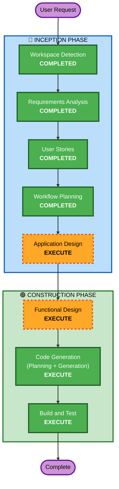

# Execution Plan

## Detailed Analysis Summary

### Change Impact Assessment
- **User-facing changes**: Yes — 新しいサイドバーUI、プロジェクト切り替え操作
- **Structural changes**: Yes — 新規拡張機能の全体アーキテクチャ設計が必要
- **Data model changes**: Yes — プロジェクト登録情報のJSON構造設計
- **API changes**: N/A — 外部APIなし（VSCode Extension API使用）
- **NFR impact**: Low — パフォーマンス要件あるが、ローカル操作のため軽微

### Risk Assessment
- **Risk Level**: Low
- **Rollback Complexity**: Easy（新規プロジェクトのため影響範囲なし）
- **Testing Complexity**: Moderate（VSCode Extension Test環境の構築が必要）

## Workflow Visualization

## Phases to Execute

### 🔵 INCEPTION PHASE
- [x] Workspace Detection (COMPLETED)
- [x] Requirements Analysis (COMPLETED)
- [x] User Stories (COMPLETED)
- [x] Workflow Planning (COMPLETED)
- [ ] Application Design - **EXECUTE**
  - **Rationale**: 新規拡張機能のため、コンポーネント構成（ツリービュープロバイダー、プロジェクトマネージャー、設定ストレージ、スキャナー）とその依存関係を明確にする必要がある

### 🟢 CONSTRUCTION PHASE
- [ ] Functional Design - **EXECUTE**
  - **Rationale**: プロジェクト登録・検出のビジネスロジック、JSONデータモデル、設定読み取りロジックの詳細設計が必要
- [ ] NFR Requirements - **SKIP**
  - **Rationale**: NFR要件はシンプル（ローカルファイルI/O中心）。パフォーマンス要件は常識的範囲で、特別な設計不要
- [ ] NFR Design - **SKIP**
  - **Rationale**: NFR Requirementsがスキップのため不要
- [ ] Infrastructure Design - **SKIP**
  - **Rationale**: ローカル拡張機能のため、インフラ設計不要
- [ ] Code Generation - **EXECUTE** (ALWAYS)
  - **Rationale**: 実装コードの計画と生成
- [ ] Build and Test - **EXECUTE** (ALWAYS)
  - **Rationale**: ビルド手順とテスト戦略の策定

### 🟡 OPERATIONS PHASE
- [ ] Operations - PLACEHOLDER

## Units Decision
- **Units Generation**: **SKIP**
  - **Rationale**: 単一の拡張機能パッケージとして実装。分解不要。MVPスコープ（8ストーリー）は1ユニットで管理可能。

## Estimated Timeline
- **Total Stages to Execute**: 4（Application Design → Functional Design → Code Generation → Build and Test）
- **Total Stages to Skip**: 4（Units Generation, NFR Requirements, NFR Design, Infrastructure Design）

## Success Criteria
- **Primary Goal**: Kiroプロジェクト間のワンクリック切り替えを実現する拡張機能
- **Key Deliverables**:
  - 動作する拡張機能コード（TypeScript）
  - package.json（拡張機能マニフェスト）
  - サイドバーツリービューUI
  - プロジェクト管理機能（追加、削除、自動検出）
  - ビルド・テスト手順書
- **Quality Gates**:
  - TypeScriptコンパイルエラーなし
  - ESLint警告なし
  - MVPストーリーのアクセプタンスクライテリアを満たす
